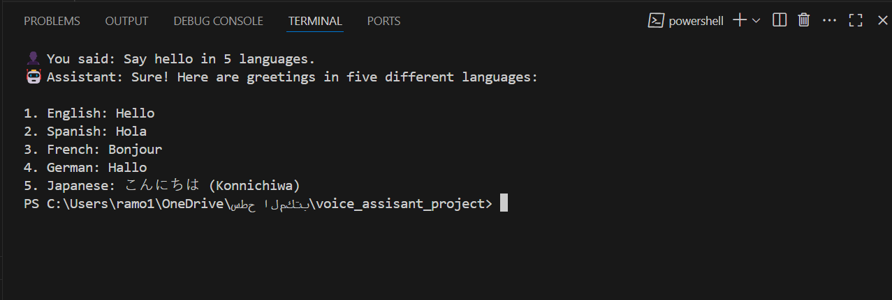

# 🎙️🤖 Voice Assistant with OpenAI and Python

This project is a simple voice assistant built with Python that allows users to speak into their microphone, transcribe the speech using OpenAI's Whisper model, generate a response using GPT-4o, and read it aloud using pyttsx3.

---

## 🛠️ Setup

Install the required dependencies:
```bash
pip install openai pyaudio pyttsx3
```
---

## 🚀 Usage

Run the script:
```bash
python voice_assistant.py
```
---

## 🌐 Language

The assistant can be set up to speak and understand either English or Arabic.  
To change the language, modify the system message inside the chat_with_gpt function:
```python
{"role": "system", "content": "You are a helpful voice assistant."}
```
For Arabic:
```python
{"role": "system", "content": "أنت مساعد صوتي مفيد وتتحدث العربية."}
```
Make sure to also speak in the same language you want the assistant to respond with.

---

## 🤖 Model

The assistant uses the following OpenAI models:

- **Whisper (`whisper-1`) for speech-to-text transcription
- **GPT-4o for generating natural responses

---

## 🖼️ Output Example

Below is a screenshot of the working assistant:



---

## 📌 Notes

- Make sure your microphone is connected and working properly.
- The response is spoken only for the first reply in this basic version.
- You can adjust the voice settings in the code by changing the voice index.
